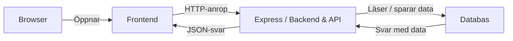

# **Applikationsbeskrivning**

**Yh Message App** är en webbapplikation för att skapa och dela meddelanden. Appen består av en frontend, en backend och en databas.

**Frontend (React + Vite)**
- En webbklient byggd med React
- Inloggning och registrering
- Formulär för att skapa, redigera och ta bort meddelanden

**Backend (Node.js + Express)**
- API-server för kommunikation mellan frontend och databas
- Databas för användare och meddelanden
- Funktioner för att skapa, läsa, uppdatera och ta bort meddelanden

## **Systemskiss**

